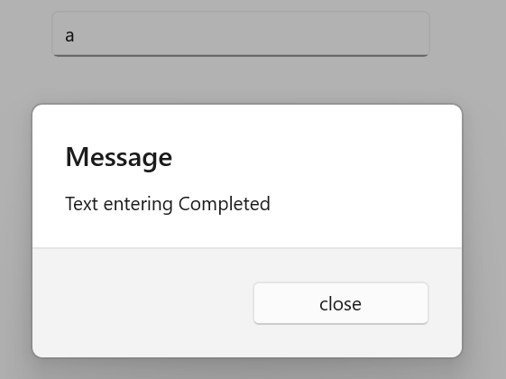

# UI Customization in .NET MAUI Autocomplete (SfAutocomplete)

This section explains different UI customizations available in the [.NET MAUI Autocomplete](https://help.syncfusion.com/cr/maui/Syncfusion.Maui.Inputs.SfAutocomplete.html) control.

## Placeholder

You can prompt the user with any information by using the [Placeholder](https://help.syncfusion.com/cr/maui/Syncfusion.Maui.Core.SfDropdownEntry.html#Syncfusion_Maui_Core_SfDropdownEntry_Placeholder) property. This text will be displayed only if no items are selected or the edit text is empty. The default value of the Placeholder property is `string.Empty` (No string will be displayed).




<editors:SfAutocomplete x:Name="autocomplete"
                        WidthRequest="250"
                        Placeholder="Select a social media"
                        ItemsSource="{Binding SocialMedias}"
                        DisplayMemberPath="Name"
                        TextMemberPath="Name" />




autocomplete.Placeholder = "Select a social media";




The following image illustrates the result of the above code:

## Placeholder Color

The placeholder text color can be changed by using the [PlaceholderColor](https://help.syncfusion.com/cr/maui/Syncfusion.Maui.Core.SfDropdownEntry.html#Syncfusion_Maui_Core_SfDropdownEntry_PlaceholderColor) property. The default value of the PlaceholderColor property is `Colors.Gray`.




<editors:SfAutocomplete x:Name="autocomplete"
                        WidthRequest="250"
                        ItemsSource="{Binding SocialMedias}"
                        DisplayMemberPath="Name"
                        TextMemberPath="Name"
                        Placeholder="Select a social media"
                        PlaceholderColor="Red" />




autocomplete.PlaceholderColor = Colors.Red;




The following gif image illustrates the result of the above code:

## Clear Button Icon Color

The clear button icon color can be changed by using the [ClearButtonIconColor](https://help.syncfusion.com/cr/maui/Syncfusion.Maui.Core.SfDropdownEntry.html#Syncfusion_Maui_Core_SfDropdownEntry_ClearButtonIconColor) property. The default value of the ClearButtonIconColor property is `Colors.Black`.




<editors:SfAutocomplete x:Name="autocomplete"
                        WidthRequest="250"
                        ItemsSource="{Binding SocialMedias}"
                        DisplayMemberPath="Name"
                        TextMemberPath="Name"
                        Placeholder="Select a social media"
                        PlaceholderColor="Red"
                        ClearButtonIconColor="Red" />




autocomplete.ClearButtonIconColor = Colors.Red;




The following gif image illustrates the result of the above code:

## Stroke

The Autocomplete border color can be changed by using the [`Stroke`](https://help.syncfusion.com/cr/maui/Syncfusion.Maui.Core.SfDropdownEntry.html#Syncfusion_Maui_Core_SfDropdownEntry_Stroke) property.




<editors:SfAutocomplete x:Name="autocomplete"
                        WidthRequest="250"
                        ItemsSource="{Binding SocialMedias}"
                        DisplayMemberPath="Name"
                        TextMemberPath="Name"
                        Placeholder="Select a social media"
                        PlaceholderColor="Red"
                        Stroke="Red" />




autocomplete.Stroke = Colors.Red;




The following gif image illustrates the result of the above code.

## Maximum DropDown Height

The maximum height of the drop-down can be changed by using the [MaxDropDownHeight](https://help.syncfusion.com/cr/maui/Syncfusion.Maui.Core.SfDropdownEntry.html#Syncfusion_Maui_Core_SfDropdownEntry_MaxDropDownHeight) property of the `Autocomplete` control. The default value of the MaxDropDownHeight property is `400d`. 

N> If the `MaxDropDownHeight` is too small compared to the populated items, the scroll viewer will be automatically shown to navigate the hidden items.




<editors:SfAutocomplete x:Name="autocomplete"
                        WidthRequest="250"
                        MaxDropDownHeight = "100"
                        ItemsSource="{Binding SocialMedias}"
                        DisplayMemberPath="Name"
                        TextMemberPath="Name" />




autocomplete.MaxDropDownHeight = 100;




The following gif image illustrates the result of the above code:

## Customize the DropDown (suggestion) item

The [ItemTemplate]() property helps you to decorate drop-down items using the custom templates. The default value of `ItemTemplate` is `null`. The following example shows how to customize drop-down items using templates.




    //Model.cs
    public class Employee
    {
        public string? Name { get; set; }
        public string? ProfilePicture { get; set; }
        public string? Designation { get; set; }
        public string? ID { get; set; }
    }

    //ViewModel.cs
    public class EmployeeViewModel
    {
        public ObservableCollection<Employee> Employees { get; set; }
        public EmployeeViewModel()
        {
            this.Employees = new ObservableCollection<Employee>();
            Employees.Add(new Employee
            {
                Name = "Anne Dodsworth",
                ProfilePicture = "people_circle1.png",
                Designation = "Developer",
                ID = "E001",
            });
            Employees.Add(new Employee
            {
                Name = "Andrew Fuller",
                ProfilePicture = "people_circle8.png", 
                Designation = "Team Lead",
                ID = "E002",
            });
            ...
        }
    }







    <editors:SfAutocomplete Placeholder="Enter an employee"
                            TextMemberPath="Name"
                            DisplayMemberPath="Name"
                            ItemsSource="{Binding Employees}"
                            WidthRequest="280"
                            HeightRequest="34"
                            x:Name="autoComplete">
        <editors:SfAutocomplete.BindingContext>
            <local:EmployeeViewModel/>
        </editors:SfAutocomplete.BindingContext>
        <editors:SfAutocomplete.ItemTemplate>
            <DataTemplate >
                <ViewCell>
                    <Grid Margin="0,5"
                          VerticalOptions="Center"
                          HorizontalOptions="Center"
                          ColumnDefinitions="48,220"
                          RowDefinitions="50">
                        <Image Grid.Column="0"
                               HorizontalOptions="Center"
                               VerticalOptions="Center"
                               Source="{Binding ProfilePicture}"
                               Aspect="AspectFit"/>
                        <StackLayout HorizontalOptions="Start"
                                     VerticalOptions="Center"
                                     Grid.Column="1"
                                     Margin="15,0,0,0">
                            <Label HorizontalTextAlignment="Start"
                                   VerticalTextAlignment="Center"
                                   Opacity=".87"
                                   FontSize="14"
                                   Text="{Binding Name}"/>
                            <Label HorizontalOptions="Start"
                                   VerticalTextAlignment="Center"
                                   Opacity=".54"
                                   FontSize="12"
                                   Text="{Binding Designation}"/>
                        </StackLayout>
                    </Grid>
                </ViewCell>
            </DataTemplate>
        </editors:SfAutocomplete.ItemTemplate>
    </editors:SfAutocomplete>




The following gif image illustrates the result of the above code:

## Customize DropDown (suggestion) items based on condition

The [ItemTemplate]() property helps you to decorate drop-down items conditionally based on their content using the custom templates. The default value of `ItemTemplate` is `null`.




    //Model.cs
    public class Employee
    {
        public string? Name { get; set; }
        public string? ProfilePicture { get; set; }
        public string? Designation { get; set; }
        public string? ID { get; set; }
    }

    //ViewModel.cs
    public class EmployeeViewModel
    {
        public ObservableCollection<Employee> Employees { get; set; }
        public EmployeeViewModel()
        {
            this.Employees = new ObservableCollection<Employee>();
            Employees.Add(new Employee
            {
                Name = "Anne Dodsworth",
                ProfilePicture = "people_circle1.png",
                Designation = "Developer",
                ID = "E001",
            });
            Employees.Add(new Employee
            {
                Name = "Andrew Fuller",
                ProfilePicture = "people_circle8.png", 
                Designation = "Team Lead",
                ID = "E002",
            });
            Employees.Add(new Employee
            {
                Name = "Andrew Fuller",
                ProfilePicture ="people_circle8.png",
                Designation = "Team Lead",
                ID = "E002",
            });
            Employees.Add(new Employee
            {
                Name = "Emilio Alvaro",
                ProfilePicture = "people_circle7.png",
                Designation = "Product Manager",
                ID = "E003"
            });
            Employees.Add(new Employee
            {
                Name = "Janet Leverling",
                ProfilePicture = "people_circle2.png",
                Designation = "HR",
                ID = "E004",
            });
            Employees.Add(new Employee
            {
                Name = "Laura Callahan",
                ProfilePicture = "people_circle10.png",
                Designation = "Product Manager",
                ID = "E005",
            });
        }
    }

    public class EmployeeTemplateSelector : DataTemplateSelector
    {
        public DataTemplate? EmployeeTemplate1 { get; set; }
        public DataTemplate? EmployeeTemplate2 { get; set; }

        protected override DataTemplate? OnSelectTemplate(object item, BindableObject container)
        {
            var employeeName = ((Employee)item).Name;
            {
                if (employeeName?.ToString() == "Anne Dodsworth" || employeeName?.ToString() == "Emilio Alvaro" ||
                    employeeName?.ToString() == "Laura Callahan")
                {
                    return EmployeeTemplate1;
                }
                else
                {
                    return EmployeeTemplate2;
                }
            }
        }
    }







    <Grid >
        <Grid.Resources>
            <DataTemplate x:Key="employeeTemplate1">
                <ViewCell>
                    <Grid Margin="0,5"
                          VerticalOptions="Center"
                          HorizontalOptions="Center"
                          ColumnDefinitions="48,220"
                          RowDefinitions="50">
                        <Image Grid.Column="0"
                               HorizontalOptions="Center"
                               VerticalOptions="Center"
                               Source="{Binding ProfilePicture}"
                               Aspect="AspectFit"/>
                        <StackLayout HorizontalOptions="Start"
                                     VerticalOptions="Center"
                                     Grid.Column="1"
                                     Margin="15,0,0,0">
                            <Label HorizontalTextAlignment="Start"
                                   VerticalTextAlignment="Center"
                                   Opacity=".87"
                                   FontSize="14"
                                   TextColor="Blue"
                                   Text="{Binding Name}"/>
                            <Label HorizontalOptions="Start"
                                   VerticalTextAlignment="Center"
                                   Opacity=".54"
                                   FontSize="12"
                                   TextColor="Coral"
                                   Text="{Binding Designation}"/>
                        </StackLayout>
                    </Grid>
                </ViewCell>
            </DataTemplate>
            
            <DataTemplate x:Key="employeeTemplate2">
                <ViewCell>
                    <Grid Margin="0,5"
                          VerticalOptions="Center"
                          HorizontalOptions="Center"
                          ColumnDefinitions="48,220"
                          RowDefinitions="50">
                        <Image Grid.Column="0"
                               HorizontalOptions="Center"
                               VerticalOptions="Center"
                               Source="{Binding ProfilePicture}"
                               Aspect="AspectFit"/>
                        <StackLayout HorizontalOptions="Start"
                                     VerticalOptions="Center"
                                     Grid.Column="1"
                                     Margin="15,0,0,0">
                            <Label HorizontalTextAlignment="Start"
                                   VerticalTextAlignment="Center"
                                   Opacity=".87"
                                   FontSize="14"
                                   TextColor="Red"
                                   Text="{Binding Name}"/>
                            <Label HorizontalOptions="Start"
                                   VerticalTextAlignment="Center"
                                   Opacity=".54"
                                   FontSize="12"
                                   TextColor="Green"
                                   Text="{Binding Designation}"/>
                        </StackLayout>
                    </Grid>
                </ViewCell>
            </DataTemplate>

            <local:EmployeeTemplateSelector x:Key="employeeTemplateSelector"
                                            EmployeeTemplate1="{StaticResource employeeTemplate1}"
                                            EmployeeTemplate2="{StaticResource employeeTemplate2}"/>

        </Grid.Resources>
        <editors:SfAutocomplete Placeholder="Enter an employee"
                                TextMemberPath="Name"
                                DisplayMemberPath="Name"
                                ItemsSource="{Binding Employees}"
                                SelectedItem="{Binding SelectedEmployee,Mode=TwoWay}"
                                WidthRequest="280"
                                HeightRequest="34"
                                x:Name="autoComplete"
                                ItemTemplate="{StaticResource employeeTemplateSelector}">
            <editors:SfAutocomplete.BindingContext>
                <local:EmployeeViewModel/>
            </editors:SfAutocomplete.BindingContext>
        </editors:SfAutocomplete>
    </Grid>




The following gif image illustrates the result of the above code:

## Completed Event

The [Completed]() event is raised when the user finalizes the text in the [SfAutoComplete](https://help.syncfusion.com/cr/maui/Syncfusion.Maui.Inputs.SfAutocomplete.html) by pressing return key on the keyboard.The handler for the event is a generic event handler, taking the `sender` and `EventArgs`(the `EventArgs` value is `string.Empty`):




    private void autoComplete_Completed(object sender, EventArgs e)
    {
        System.Diagnostics.Debug.WriteLine("Completed");
    }




The completed event can be subscribed to in XAML:




    <editors:SfAutocomplete x:Name="autoComplete"
                            WidthRequest="280" 
                            HeightRequest="34"
                            Completed="autoComplete_Completed" />




    private async void combobox_Completed(object sender, EventArgs e)
    {
        await DisplayAlert("Message", "Text entering Completed", "close");
    }




The following image illustrates the result of the above code:

## Text

The [Text]() property used to gets the user-submitted text in the [SfAutoComplete](https://help.syncfusion.com/cr/maui/Syncfusion.Maui.Inputs.SfAutocomplete.html). The default value of the `Text` property is `string.Empty`.

N> [Text]() property is Read only.